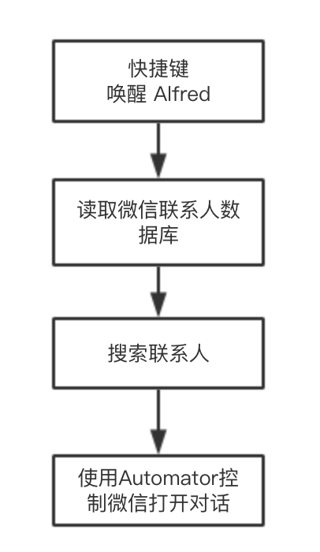
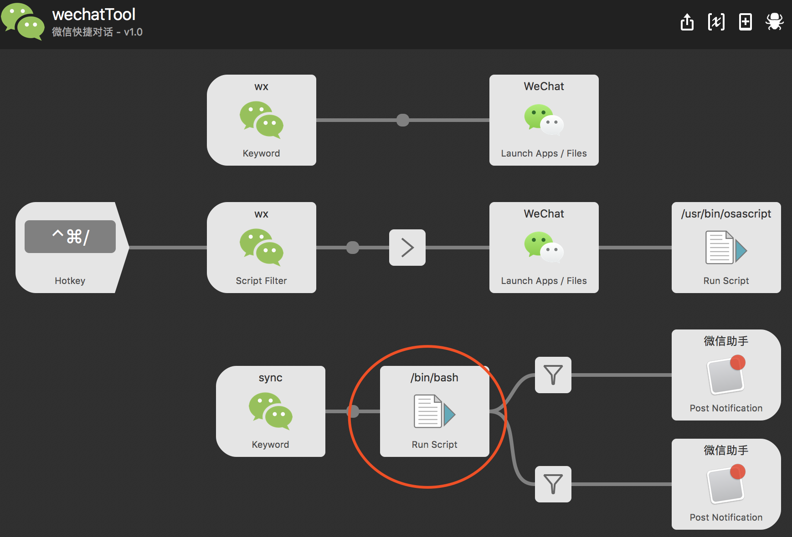

## 特性
- 支持搜索微信好友
- 支持搜索微信群
- 支持模糊搜索：中文、拼音、简拼
- 快速打开对应对话框

## 原理

> 其中读取微信数据库步骤，需要用到 lldb 给微信打断点，获取数据库密码。
> 
> PS：期待更好的数据库密码获取方式。

## 使用说明
1. 下载安装
2. 修改以下脚本中的两个参数

3. 打开Alfred，输入 “sync”，同步微信联系人数据
4. 开始使用

## 相关介绍
https://www.jianshu.com/p/8a2df7086452
